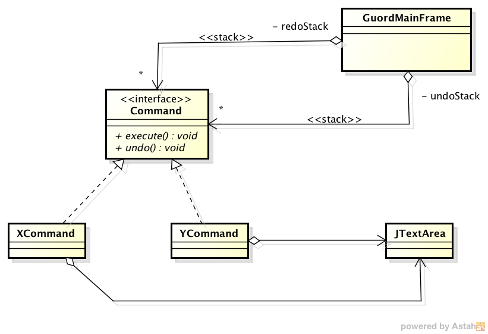

###Escuela Colombiana de Ingenieria
###Procesos de desarrollo de Software - PDSW


__Taller - diseño de pruebas: clases de equivalencia, condiciones de frontera, análisis de transiciones.__

__Parte I__

1. Descargue e importe el proyecto.
2. Revise cómo es la estructura de Maven para separar las pruebas de los demás artefactos del proyecto: src/main, src/test.
3. Ejecute la fase de pruebas del proyecto con el comando, y analice cómo son presentados los resultados.

	```
mvn test
	```
4. Implemente un caso de prueba para cada clase de equivalencia/condicion de frontera identificado. Recuerde usar la anotacion @Test y seguir la conveción de nombres: 

	```java
/**
* Pruebas clase de equivalencia XX: [Aquí la especificación de la clase de equivalencia]
**/
@Test
public void testClaseEquivalenciaXX(){
	...
}
	```

5. Una vez implementadas las pruebas, haga la implementación que ya hizo un 'programador poco confiable', en el archivo algoritmo-ProgramadorPocoConfiabe.txt.
6. Ejecute las pruebas. A partir de los resultados obtenidos, identifique los posibles problemas que tenga la implementación.
7. Hága el análisis de cobertura de sus pruebas, mediante el comando:
	
	```
mvn cobertura:cobertura
	```
	y posteriormente revisando el reporte en target/site/cobertura/. A partir de esto, identifique casos de prueba adicionales para que el cubrimiento de saltos mejore (ojalá al 100%).


__Parte II.__

En este ejercicio se va a retomar el caso del 'procesador de palabras' de los ejercicios anteriores. 

Se requiere que el procesador de palabras ahora soporte las opciones de rehacer/deshacer, en la medida que se escribe. Específicamente, se espera el siguiente comportamiento:

- Durante la escritura normal al deshacer, se borrarán los últimos 5 caracteres escritos.
- Cada eliminación de caracteres (con backspace) debe poderse deshacer (es decir, debe reaparecer el caracter borrado).
- Se debe tener en cuenta que al momento de deshacer, el cursor (caret) puede estar en una posición difernete a la que se realizó la operación, de manera que el texto debe aparecer o desaparecer (según corresponda) en su posición original.
- Si se oprime el back-space después de tener una área del texto seleccionada, el 'deshacer' de esta acción debería recuperar todo el texto escrito.

Para hacer esto, realice lo siguiente:

__Parte II.a.__ (Para revisar en clase)

1. Aplique el patrón comando, siguiendo el siguiente esquema. Identifique el número y tipo de los comandos concretos que se requerirían para lo antes planteado.



2. Para cada Comando concreto identificado, haga el análisis de clases de equivalencia y condiciones de frontera de sus métodos 'execute()' y 'undo()'.
3. Entregar en clase impreso: Modelo de clases y listado de las clases de equivalencia.

__Parte II.b.__ 

1. Implemente los CASCARONES de los comandos (es decir, cree las clases, haga la especificación de los métodos, pero NO implemente los métodos).

2. Implemente las pruebas a partir de las clases de equivalencia identificadas, siguiendo el esquema de la parte I.

3. Implemente los comandos, y haga uso de las pruebas (mvn test) para verificar que la implementación sea correcta.

__Tips.__

* Para interceptar los eventos de teclado, puede hacer uso de un 'KeyListener', asociado al área de texto. Tenga también en cuenta que el objeto KeyEvent permite indentificar específicamente qué tecla ha sido presionada.

	```java
        textArea.addKeyListener(new KeyListener() {
            @Override
            public void keyPressed(KeyEvent e) {
                ...
            }

            @Override
            public void keyTyped(KeyEvent e) {
	            	...
            }

            @Override
            public void keyReleased(KeyEvent e) {
            		...
            }
        });
	```
* Tenga en cuenta el API de [JTextArea](https://docs.oracle.com/javase/7/docs/api/javax/swing/JTextArea.html), y funciones que permiten manipular programáticamente su contenido, tales como:

	* insert
	* replaceRange
	* getCaretPosition
	* getSelectedText
